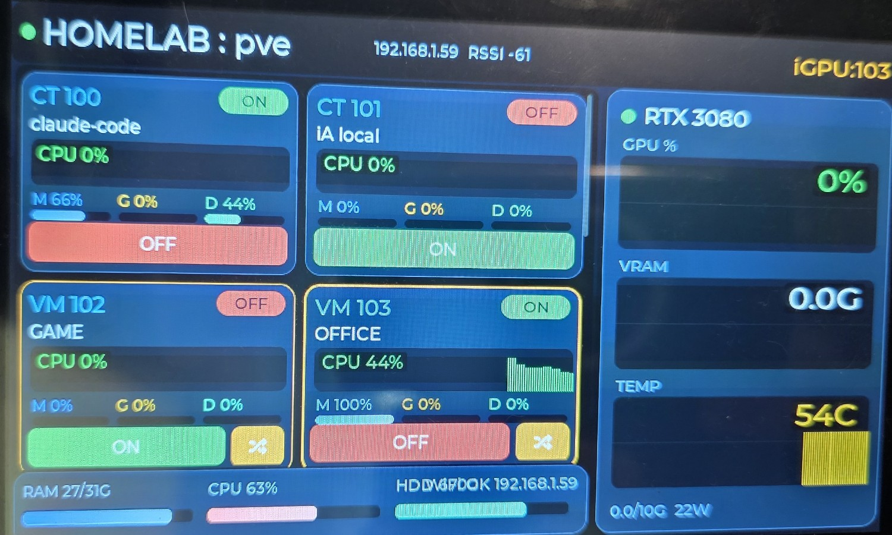

# esp32-s3-proxmox-panel

A **7-inch touch dashboard for a Proxmox VE host**: a Waveshare ESP32-S3 with an 800×480 IPS
touch screen that lists every VM and LXC container, shows live per-machine and GPU telemetry, and
lets you start / stop (and iGPU-switch) them — no browser, no SSH.

<p align="center">
  
</p>
<p align="center"><sub>Live homelab dashboard: per-machine CPU history + MEM/GPU/DISK, an RTX 3080 panel with 5-min sparklines, and a host RAM/CPU/HDD summary.</sub></p>

This is the **big-screen sibling** of the 4" version
[`esp32-proxmox-panel`](https://github.com/chemazener/esp32-proxmox-panel) and reuses the **same
FastAPI backend** (`vm-switcher-api`). The panel is a thin WiFi client; all the Proxmox logic lives
in that backend, which talks to the host with `qm`/`pct`/`pvesh`.

## Features

- **One card per VM / CT** with live status and a **single, state-aware action button**: it shows
  **ON** (green) when the machine is stopped and **OFF** (red) when it is running — no dead buttons,
  more room for graphics.
- **Per-machine CPU sparkline** with rolling history (gradient area chart) plus compact
  **MEM / GPU / DISK** gradient bars with values.
- **RTX 3080 panel** with three **5-minute history sparklines** (GPU %, VRAM, temperature), each with
  a large current value and level-based colouring (green → amber → red).
- **iGPU-group switch**: GPU-passthrough VMs get a **⇄** button that shuts down the active one and
  boots the target — mutual exclusion for a shared passthrough GPU.
- **Host summary**: RAM / CPU / HDD of the Proxmox host.
- **Animated & themed UI** (LVGL): smooth bar transitions, a pulsing "live" ping-ring indicator,
  gradient backgrounds and soft shadows.
- **Auto screen-off on host inactivity**: the backlight follows the host's monitors. When there is
  no keyboard/mouse activity the display blanks (and wakes on activity or on a local touch), so the
  panel sleeps together with the host. Driven by the backend's `host.idle` flag.
- **OTA firmware updates** over WiFi after the first USB flash.
- **~millisecond UI latency**: the backend refreshes Proxmox state in a background thread and serves
  from cache, so the panel never blocks on the host inventory.

## Repository layout

| Path | What |
|---|---|
| `platformio.ini` | PlatformIO project (Arduino + LovyanGFX + LVGL 8). Two envs: `s3-7c` (USB) and `s3-7c-ota` (WiFi). |
| `src/main.cpp` | Firmware: UI, polling, touch, backlight/idle, OTA. |
| `src/lgfx_7c.h` | LovyanGFX config for the RGB panel (pinout + timings). |
| `include/lv_conf.h` | Minimal LVGL config (RGB565 with byte-swap; see gotchas). |
| `include/secrets.example.h` | Copy to `include/secrets.h` and fill in WiFi + API host/token. |
| `docs/` | Photos. |

The **backend** (`vm-switcher-api`) is shared with the 4" project — see
[`esp32-proxmox-panel/backend`](https://github.com/chemazener/esp32-proxmox-panel/tree/main/backend).
It exposes `/machines`, `/occupancy`, `/gpu`, `/start`, `/stop`, `/switch`, … and (for auto screen-off)
a `host.idle` field in `/occupancy`.

## Hardware

- **Waveshare ESP32-S3-Touch-LCD-7C**: ESP32-S3 (WROOM-2, 16 MB PSRAM / 32 MB flash), 7" **800×480**
  RGB IPS panel (ST7262), **GT911** capacitive touch, I²C IO-expander (0x24) for backlight/reset.
- A **Proxmox VE** host reachable over SSH from wherever the backend runs.

## Build & flash

PlatformIO. Copy `include/secrets.example.h` → `include/secrets.h` and set your WiFi and the backend
`API_HOST` / `API_PORT` / `API_TOKEN`.

```bash
# Compile
pio run -e s3-7c

# First flash over USB (native USB-CDC). The stock Debian esptool is broken for
# this board's 32 MB octal flash — use a recent esptool (>=5.x):
esptool --chip esp32s3 --baud 921600 --after hard-reset write-flash \
  --flash-mode dout --flash-freq 80m --flash-size 16MB \
  0x0 .pio/build/s3-7c/bootloader.bin \
  0x8000 .pio/build/s3-7c/partitions.bin \
  0xe000 ~/.platformio/packages/framework-arduinoespressif32/tools/partitions/boot_app0.bin \
  0x10000 .pio/build/s3-7c/firmware.bin

# From then on, OTA over WiFi:
pio run -e s3-7c-ota -t upload      # set upload_port to the panel's IP in platformio.ini
```

### Gotchas

- **Octal flash/PSRAM (WROOM-2)**: `board_build.arduino.memory_type = opi_opi`, `flash_mode = dout`,
  `f_flash = 80 MHz`. With QIO the bootloader fails to init the octal flash and bootloops.
- **RGB565 byte order**: use `LV_COLOR_16_SWAP = 1` in `lv_conf.h` **and** `lcd.setSwapBytes(false)`
  in `main.cpp`. With both off, the palette comes out scrambled on the S3's parallel RGB bus.
- **LVGL `%f`**: `lv_label_set_text_fmt` does not support floating-point specifiers by default —
  pre-format floats with `snprintf` and use `lv_label_set_text`.
- The 7" panel needs a **proper 5 V supply / battery**; powered from a weak USB port the WiFi TX
  current spikes can prevent association.

## Related

- [`esp32-proxmox-panel`](https://github.com/chemazener/esp32-proxmox-panel) — the original 4" (ST7796)
  version, including the shared backend and a 3D-printed case.

## License

MIT — see [LICENSE](LICENSE).
